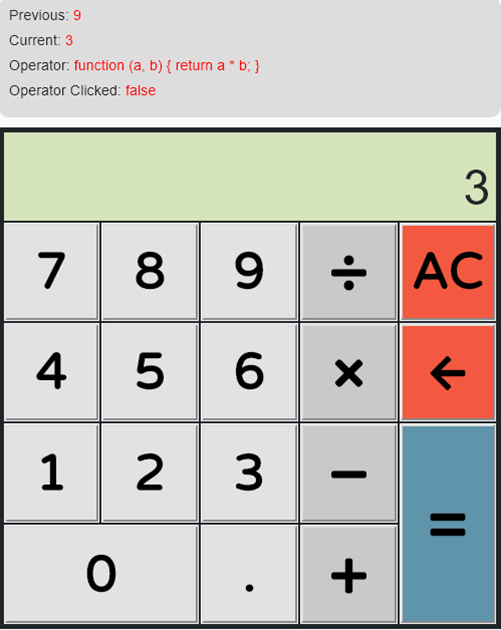
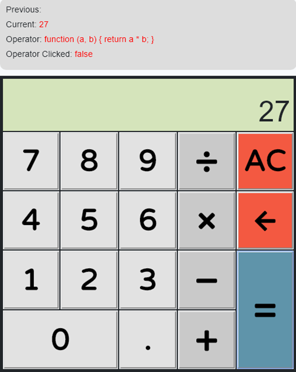

<p align="center"></p>

<p align="center">
<a href="https://travis-ci.org/laravel/framework"></a>
<a href="https://packagist.org/packages/laravel/framework"></a>
<a href="https://packagist.org/packages/laravel/framework"></a>
<a href="https://packagist.org/packages/laravel/framework"></a>
</p>

## Sobre o projeto

Calculadora desenvolvida com Laravel e Vue.js.





## Passo a Passo
#### Configuração - Backend 
```
# Instalar dependências do projeto
$ composer install

# Configurar variáveis de ambiente
$ cp .env.example .env
$ php artisan key:generate
```

#### Configuração - Frontend
```
# Atualizar dependências
$ npm install

# Rodar em ambiente local
$ npm run dev

# Rodar em ambiente de produção
$ npm run build

# Serve no modo de produção
$ npm start
```
